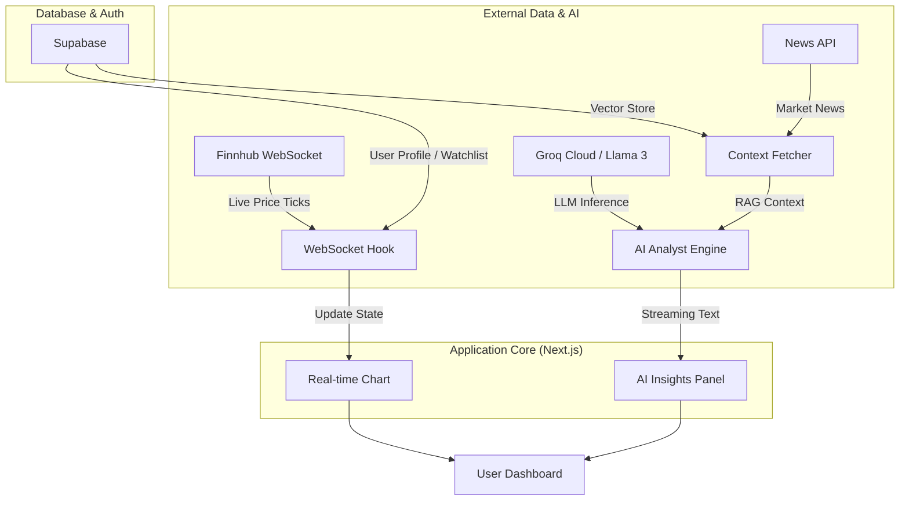

# AI-Market-Agent: Real-Time GenAI Financial Analyst

> **Live Market Insights powered by Agentic AI and Real-time WebSockets.**

## 1. Project Overview
This repository demonstrates a **multimodal Agentic RAG system** designed to bridge the gap between static LLM training data and real-time market fluctuations. Unlike standard chatbots, this agent uses **Function Calling** to fetch live trade data and news, providing context-aware financial sentiment analysis.

*(Add a screenshot of your dashboard here once the UI is ready)*

## 2. System Architecture



## 3. Key Features
* **Live Data Streaming:** Real-time stock "ticks" via **Finnhub WebSockets** for sub-100ms UI updates.
* **Agentic Reasoning:** Powered by **Llama 3 (via Groq)** to perform technical analysis on the fly.
* **Context-Aware RAG:** Integrates **Supabase (pgvector)** to retrieve historical news and correlate it with current price action.
* **Interactive Visualization:** Professional-grade candlestick charts using **TradingView’s Lightweight Charts**.

---

## 4. Tech Stack
* **Frontend:** Next.js 15, Tailwind CSS, Shadcn/UI
* **AI Orchestration:** Vercel AI SDK (Streaming & Tool Calling)
* **LLM Inference:** Groq Cloud (Llama 3.1)
* **Backend/Infrastructure:** GitHub Codespaces, GitHub Actions (CI/CD)
* **Database:** Supabase (PostgreSQL & Vector Store)

---

## 5. Development Workflow (GitHub Student Developer Pack)
This project leverages the **GitHub Student Developer Pack** for industry-standard development:
* **GitHub Copilot:** Used for pair-programming and logic optimization.
* **GitHub Codespaces:** Provided a consistent cloud-native development environment.
* **Vercel:** Automated CI/CD deployment pipeline.

---

## 6. Setup & Installation

1. **Clone the repository:**
   ```bash
   git clone [https://github.com/AmirthaVarshni26/ai-stock-agent.git](https://github.com/AmirthaVarshni26/ai-stock-agent.git)
   ```
2. **Install dependencies:**
   ```bash
   npm install
   ```
3. **Configure Environment Variables:**
   Create a `.env.local` file with your Groq, Finnhub, and Supabase keys.
4. **Run the development server:**
   ```bash
   npm run dev
   ```
```
